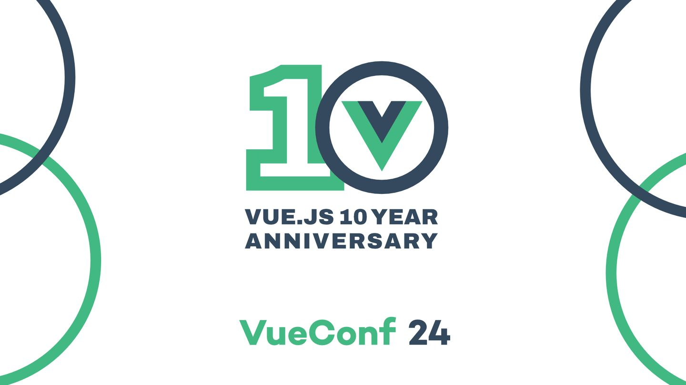
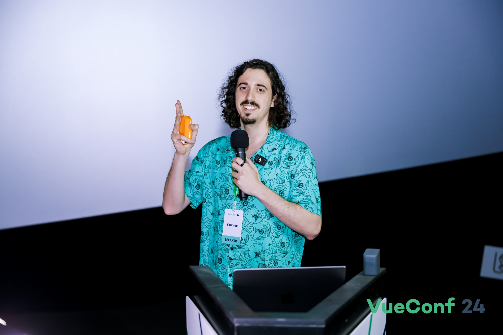
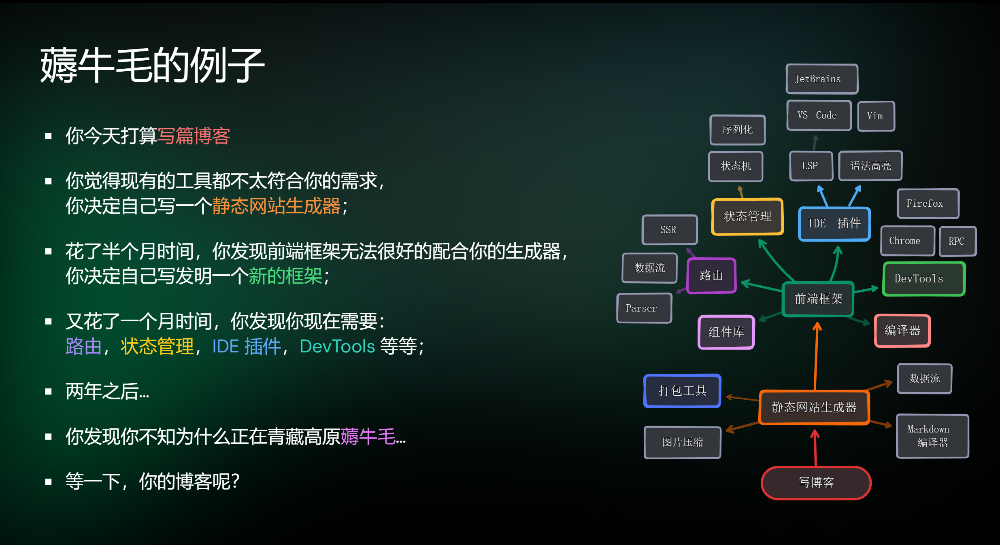
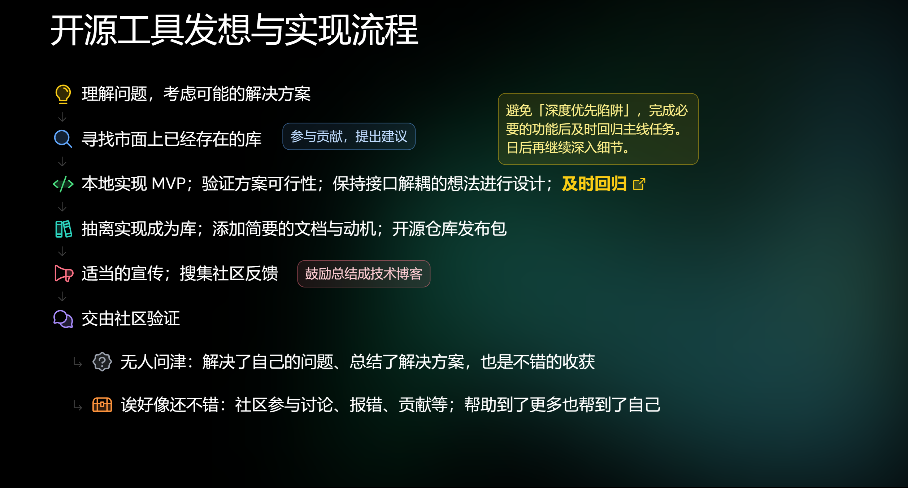

# VueConf 24 之旅 




>ps： 记录我参加VueConf 24 旅途后的一些内心感想！！！😀😀😀😀😀


首先最先开始的是赵锦江老师对vuejs 10年的历程和通过一些小故事引出关于开源方面的一些建议， 我对此做一个简单的总结：

```
做一个成功的开源项目，首先要有一个开阔的视野，对自己想做的事情有一个明确的认识,然后尽全力的去拉拢自己项目的用户群体，对网络上的流言蜚语不要在意，专心做好自己的事情，然后要做好自己生活工作上与开源上的平衡。
```

中间许多的建议，我觉得不仅仅可以用再开源上面，对我们自己做任何项目都有很大的帮助和启发，在我们开始做一个项目的时候，首先就需要去不断的看看外面别人的作品，总结他们的优点，积累开阔的视野，才能做出好的项目作品.


主要是介绍了`defineLoader` vue-Router 的数据加载器扩展, 我目前对他的简单理解是，就是通过再路由跳转前先进行数据获取。

关于这部分的文档：https://uvr.esm.is/rfcs/data-loaders/

这是我很感兴趣的一个部分， 演讲嘉宾是 来自法国巴黎 Eduardo， 讲的内容英文，虽然 Eduardo 已经很用很慢的语速来讲，但我还是听不懂😣，英语太差了。 但是这更加激起我认真学好英语的决心了。




然后就是关于新一代的`vue DevTools`的应用， 以及他的一些特性，功能等介绍， 这部分我不是很感兴趣，后面的闪电分享是关于一些关于底层基建上的简单科普，讲述了关于SFC编译方面的知识.


之后的**全新的vue组件书写方式** 讲述的主要是如何在vue单文件组件中使用编写多个组件， 主要是通过`vue vine`       来返回函数式组件（和React很像，个人觉得如果硬要使用的话不如用    `defineComponent` 返回jsx）, 感兴趣的可以看看官网：https://vue-vine.dev/


后面的就是关于`Vue Vapor` 以及`Vue Mini` 的介绍， vapor 是一种用来直接将vue 模板编译成真是dom的技术, 跳过了虚拟dom 的流程，增强了性能，  并且可以与vue 原本的无缝衔接使用，这样我们可以在**性能焦点** 部分就可以使用该技术。 `vue Mini` 的话是用于编写小程序方面的框架， 其优点是快 (与 Taro 3 相比较快10倍) ，但是目前支持原生小程序， 且主要使用的是vue3 的语法格式来编写js 部分的代码， 其模板使用的还是原生小程序的语法格式.


接下来就Anthony 托尼老师 介绍关于开源之路。

主要说明了我们在做一个自己想做的项目时不能陷入到**薅牛毛下的困境** （薅羊毛及：指在解决问题的过程引发的一系列任务链导致最终偏离了原本的目标）



然后从自身的需求出发，对问题有更深入的理解, 解决自己的问题.



详情:https://talks.antfu.me/2024/vueconf-shenzhen/1


未完待续。。。。